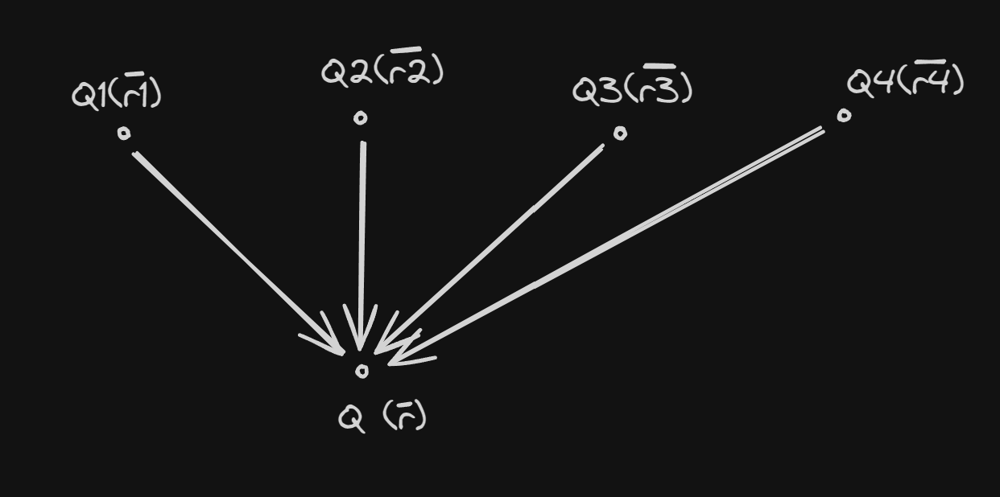

# Intro 
- Any effect (ex. gravitational, coulomb etc.)  $\alpha \, \frac{1}{d^2}$ 
	- Reason - we can simplify any force/effect to a point charge which has a spherical region of effect.
## Coulomb's law
The law describes a relation of electromagnetic force with the following factors - 
- Shortest distance between charges - $F \; \alpha \; \frac{1}{d^2}$
- The value of the charges itself
- $$F \; \alpha \; \frac{Q1 * Q2}{d^2} \Rightarrow F \; = \; k*\frac{Q1 * Q2}{d^2}$$ where $$k = \frac{1}{4\pi\varepsilon}$$
- $\varepsilon$ ->is the permittivity of a medium. This is extremely hard to measure practically, in which case we use a different formula. $$C = \frac{\varepsilon * A}{d}$$
- Relative permittivity is defined as $$\varepsilon = \varepsilon_o * \varepsilon_r \;\; ; \;\;C = \frac{1}{\sqrt{\mu_n \varepsilon_o}}$$
- Both equations become $$V = \frac{1}{\sqrt{\mu_o \,\varepsilon_o \,\varepsilon_r}}\;\Rightarrow \;\frac{C}{V} = \sqrt{\varepsilon_r}$$
> **Note :-**
>$\varepsilon_o = 8.854 \times 10^{-12} \frac{F}{m}$

## Geometric Systems
- Cartesian
	- Consists of x, y, z co-ordinates
- Cylindrical
	- A 2d circle extended along the center along the z axis to make it a 3d system
- Spherical
	- System in which the points are represented with respect to the distance from the origin and the angles $\theta$ and $\phi$ 
## Coulombs (again but with vectors)

$$|\overline{F_{12}}| \Rightarrow \frac{Q_1Q_2}{4\pi\varepsilon_o|\overline{r_{12}}|^2} \; ; \; F_{12} = |\overline{F12}|\hat{r_{12}}$$
$$\hat{r_{12}} = \frac{|r_{12}|}{|\overline{r_{12}}|}$$
$$F_{12} = \frac{Q_1 Q_2 \; \overline{r_{12}}}{4\pi\varepsilon_o |r_{12}|^3}$$
### Superposition (1 force doesn't know/care abt the other)

$$\overline{F} = \frac{1}{4\pi\epsilon_o} (
\frac{QQ_1 (\overline{r} - \overline{r_1})}{|\overline{r} - \overline{r_1}|^3} + 
\frac{QQ_2 (\overline{r} - \overline{r_2})}{|\overline{r} - \overline{r_1}|^3} + 
\frac{QQ_2 (\overline{r} - \overline{r_3})}{|\overline{r} - \overline{r_1}|^3} + \cdots)$$