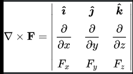

# Electrostatics Formula
## Table of Content
- [Unit 1](#unit-1)
	- [Coulombs Law](#coulombs-law) *
	- [Electric Fields](#elctric-fields) *
		- [Point Charge](#point-charge)
		- [Line charge](#line-charge)
		- [Surface charge](#surface-charge)
		- [Volume charge](#volume-charge)
		- [Uniformly Charged Sphere](#volume-charge) *
	- [Electric Flux Density](#electric-flux-density) *
	- [Gradient](#gradient)
		- [Cartesian](#cartesian)
		- [Cylindrical](#cylindrical)
		- [Spherical](#spherical)
	- [Divergence](#divergence)
		- [Divergence Theorem](#divergence-theorem)
	- [Gauss Law](#gauss-law) *
	- [Applying Gauss law](#applying-gauss-law)
	- [Electric Potential](#electric-potential) *
	- [Relation b/w E and V](#relation-between-e-and-v) *
	- [Continuity Equation](#continuity-equation) *
	- [Relaxation Time](#relaxation-time) *
	- [Poisson's Equation](#poissons-equation)
	- [Laplace Equation](#laplace-equation)
- [Unit 2](#unit-2)
	- [Boundary Conditions](#boundary-conditions) *
	- [Drift Velocity](#drift-velocity)
	- [Ohm's Law](#ohms-law)
	- [Resistance](#resistance)
	- [Conductivity](#conductivity)
	- [Joule's Law](#joules-law)
	- [Polarisation](#polarisation)
	- [Capacitance](#capacitance)
		- [Parallel Plate](#parallel-plate)
		- [Coaxial](#coaxial)
		- [Spherical](#spherical)
		- [Configurations](#configurations)
			- [Parallel](#parallel)
			- [Series](#series)

`* - Important Derivations`

## Unit 1
### Coulombs Law
$$F = \frac{1}{4\pi \varepsilon} \cdot \frac{Q_1 Q_2}{r^2}\hat{a}_r$$

### Electric Fields
#### Point charge
$$D = \frac{Q}{4\pi r^2}a_r$$

$$E = \frac{Q}{4\pi \varepsilon r^2}a_r$$

#### Line charge

$$E = \frac{-\rho_L}{4\pi\varepsilon_o\rho}\int_{\alpha_1}^{\alpha_2}{[cos(\alpha) a_\rho+sin(\alpha)a_z]d\alpha}$$

- Where $\alpha_1$ and $\alpha_2$ are angles that the line subtends to the point
- Infinite line charge -

$$E = \frac{\rho_L}{2\pi\varepsilon_o\rho}a_p$$

#### Surface charge
- Electric field due to surface charge is

$$E = \int_S \frac{\rho_sdS}{4\pi\varepsilon_0R^2}a_R$$

- Substituting $dS \rightarrow \rho\ d\phi\ d\rho$ and solving for **Infinite Sheet Charge**

$$E = \frac{\rho_s}{2\varepsilon_0}a_n$$

- Where $a_n$ is unit vector perpendicular to sheet

#### Volume charge
- Electric field due to volume charge is

$$E = \int_S \frac{\rho_sdV}{4\pi\varepsilon_0R^2}a_R$$

- With $a_R = cos(\alpha) a_Z - sin(\alpha) a_p$ 

$$E = \frac{Q}{4\pi \varepsilon_o} z^2$$

$$Q = \rho_v \frac{4}{3}\pi a^3$$

$$\overline{E}_z = \frac{\rho_v}{4\pi \varepsilon_o z^2} \frac{4\pi a^3}{3}$$
### Electric Flux Density
Also known as Electric Displacement

$$\overline{D} = \varepsilon_o \overline{E}$$

$$\Psi = \int_S \overline{D} \cdot d\overline{S}$$

### Gradient

$$\nabla A = lim_{\Delta v \rightarrow 0} \frac{\int_S A \cdot dS}{\Delta V}$$

#### Cartesian

$$\nabla A = \frac{\partial A_x}{\partial x}+\frac{\partial A_y}{\partial y}+\frac{\partial A_z}{\partial z}$$

#### Cylindrical

$$\nabla A = \frac{\partial A_\rho}{\partial \rho}+\frac{1}{\rho}\frac{\partial A_\phi}{\partial \phi}+\frac{\partial A_z}{\partial z}$$

#### Spherical

$$\nabla A = 
\frac{\partial A_r}{\partial r}+
\frac{1}{r}\frac{\partial A_\theta }{\partial \theta}+
\frac{1}{rsin\theta}\frac{\partial A_\phi}{\partial \phi}$$

### Divergence

>[!Note]
>General formula
>
>$$\nabla \cdot A = \frac{1}{h_1 h_2 h_3}[\frac{\partial\ h_2 h_3}{\partial u_1}+\frac{\partial\ h_1 h_3}{\partial u_2}+\frac{\partial\ h_1 h_2}{\partial u_3}]A$$
>

#### Divergence Theorem
$$\int_S A \cdot dS = \int_V \nabla \cdot A\ dV$$ 

- Total outward flux of a vector field through closed surface S is same as volume integral of the divergence of A

### Gauss law

$$\Psi = \int_S D \cdot dS = Q_{enclosed} = \int_V \rho_v\ dV$$

- Applying divergence theorem 

$$\int_S D \cdot dS  = \int_V \nabla \cdot D\ dV$$

- Comparing the equations :- We get Maxwell's 1st equation 

$$\rho_V = \nabla \cdot D$$

#### Applying Gauss law
- Infinite line charge

$$\rho_L l = Q = \int_S D \cdot dS = D_\rho \int_S dS = D_\rho\ 2\pi\ \rho\ l$$

$$D_\rho = \frac{\rho_L l}{2\pi\ \rho\ l}\ \rightarrow\ D = \frac{\rho_L}{2\pi\ \rho}a_\rho$$

- Infinite sheet charge

$$\rho_S A = D_z(A+A) = 2D_zA$$

$$D = D_z a_z = \frac{\rho_s}{2}a_z\ (or)\ E = \frac{\rho_s}{2\varepsilon_o}a_z$$

- Uniformly charged sphere

$$D = 
\begin{cases}
\frac{r}{3}\ \rho_o\ a_r & \text{if } 0 \lt r \le a\\
\frac{a^3}{3\ r^2}\ \rho_o\ a_r & \text{if } r \ge a
\end{cases}$$

### Electric Potential

$$V_{BA} = \frac{W}{Q} = - \int_A^B E \cdot dl$$

- Absolute potential - work done per charge to bring it from infinity to r

$$V = - \int_\infty^r E \cdot dl$$

### Relation between E and V
- For a closed loop:- 

$$\int_L E \cdot dl = 0$$

>[!Note]
>**Stoke's Theorem**
>$$\int \int_S (\overline{\nabla} \times \overline{B} ) . dS = \oint_L B . d\overline{l}$$
>
>**Curl**
>

- Applying **stoke's theorem**

$$\int_L E \cdot dl = \int_S(\nabla \times E) \cdot dS = 0\ (or)\ \nabla \times E = 0$$
 
 - Electric field is the gradient of V :-
 
 $$E = -\nabla V$$
 
### Continuity Equation

$$I_{out} = \oint J.dS = -\frac{dQ_{in}}{dt}$$

- With divergence theorem :-

$$\oint J.dS = \int_v \nabla . J\ dV$$ 

- Also

$$-\frac{dQ_{in}}{dt} = -\int_v \frac{\partial \rho_v}{\partial t} dV$$

- Therefore **Continuity Equation**

$$\nabla .J = -\frac{\partial \rho_v}{\partial t}$$

>[!Note]
>For DC current 
> 
> $\frac{\partial \rho_v}{\partial t} = 0$
> 
>Therefore 
> 
> $\nabla .J =0$
> 

### Relaxation time

$$\rho_v = \rho_{vo}\ e^{-\frac{t}{T_r}}
\text{ where } T_r = \frac{\varepsilon}{\sigma}
$$

### Poisson's Equation

$$\nabla^2 V = -\frac{\rho_v}{\varepsilon_o}$$

> [!Note]
> Laplacian operator :-
> General Formula
> 
>$$
>\nabla^2 A = \frac{1}{h_1 h_2 h_3}\ [\ 
>\frac{\partial}{\partial a_1}\ (\frac{h_2 h_3}{h_1}\frac{\partial A}{\partial a_1})+
>\frac{\partial}{\partial a_2}\ (\frac{h_1 h_3}{h_2}\frac{\partial A}{\partial a_2})+
>\frac{\partial}{\partial a_3}\ (\frac{h_1 h_2}{h_3}\frac{\partial A}{\partial a_3})
>\ ]$$
>- Cartesian $(x,y,z)$ - $(h1,h2,h3) = (1,1,1)$
>- Cylindrical $(\rho,\phi,z)$ - $(h1,h2,h3) = (1,\rho,1)$
>- Spherical $(r, \theta, \phi)$ - $(h1,h2,h3) = (1,r,r sin(\theta))$
> 
### Laplace Equation
If there is no charge enclosed in the volume :-

$$\nabla^2 V = 0$$

---

## Unit 2
### Boundary conditions
Maxwell's Equations :-

$$\oint_S \overline{D} . d\overline{S} = Q_{enc} \rightarrow 1^{st} \text{ Equation}$$

$$\oint_L \overline{E}.d \overline{l} = 0 \rightarrow 2^{nd} \text{ Equation}$$

#### Dielectric - Dielectric

$$\varepsilon_1 = \varepsilon_o\ \varepsilon_{r1} \text{ (and) } \varepsilon_2 = \varepsilon_o\ \varepsilon_{r2}$$ 

- For a closed path `abcda`. The tangential components of an electric field crossing the interface undergoes no change :-  
 
$$E_{1t} = E_{2t}$$

 - Or 

$$\frac{D_{1t}}{\varepsilon_1} = \frac{D_{2t}}{\varepsilon_2}$$

- Similarly for cylindrical Gaussian surface

$$D_{1n} - D_{2n} = \rho_s$$  

- Or when $\rho_s = 0$ where $\rho_s$ is charge density in the interface surface

$$\varepsilon_1\ E_{1n} = \varepsilon_2\ E_{2n}$$

- Refraction

$$\frac{\tan \theta_1}{\tan \theta_2} = \frac{\varepsilon_1}{\varepsilon_2} = \frac{\varepsilon_{r1}}{\varepsilon_{r2}}$$

- $\theta_1$, $\theta_2$ -> angle of electric field with normal to surface in each medium

#### Conductor - Dielectric

$$E_t = 0$$

$$D_n = \rho_s$$

#### Conductor - Free space

$$D_t = \varepsilon_o E_t = 0$$

$$D_n = \varepsilon_o E_n = \rho_s$$

### Drift velocity
$$v_e = -\mu_e \overline{E}$$

### Ohms law 
$$R = \frac{V}{I}$$

- Point form
$$\overline{J} = \sigma \overline{E}$$

### Resistance
$$R = \frac{l}{\sigma A}$$

### Conductivity
$$G = \frac{\sigma A}{l} = \frac{A}{\rho\ l}$$

### Joules law
$$P \text{(power)} = \int_v \overline{J} \cdot \overline{E} dV$$

### Polarisation
$$\overline{D} = \varepsilon_o\overline{E} + \overline{P}$$

- P -> electric polarisation field

$$\overline{P} = \varepsilon_o \chi_e \overline{E}$$

$$\overline{D} = \varepsilon_o \overline{E} + \overline{P} = \varepsilon \overline{E}$$

$$\varepsilon_r = \varepsilon_o (1+\chi_e)$$

- $\chi_e$ -> Susceptibility
- $\varepsilon_r$ -> relative permeability or dielectric strength

### Capacitance
$$C = \frac{Q}{V}$$

$$RC = \frac{\varepsilon}{\sigma}$$

#### Parallel Plate

$$C = \frac{Q}{V} = \frac{\varepsilon S}{d}$$

$$W_E = \frac{1}{2}\int_v\varepsilon E^2 dv= \frac{1}{2} C V^2 = \frac{1}{2}QV = \frac{Q^2}{2C}$$

#### Coaxial

$$E = \frac{Q}{2\pi\varepsilon L} ln\frac{b}{a}$$

$$C = \frac{2\pi \varepsilon L}{ln\frac{b}{a}}$$

#### Spherical
$$C = \frac{4\pi\varepsilon}{\frac{1}{a} - \frac{1}{b}}$$

#### Configurations
##### Parallel
$$C = C_1 + C_2$$

##### Series
$$\frac{1}{C} = \frac{1}{C_1} + \frac{1}{C_2}$$

