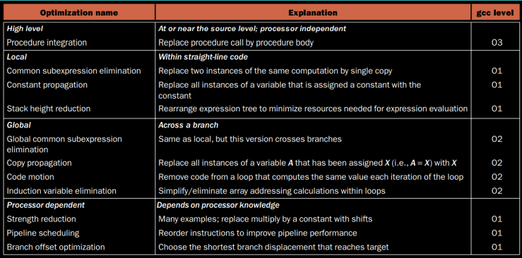

# Translating a program
## Phases
1. Compiler:
	- High level -> assembly (Psuedo instructions)
2. Assembler:
	- Assembly -> machine code
	- Psuedo instructions -> Pure assembly
	- Resolve all the address of labels using the symbol table
3. Linker:
	- Link the headers/ libraries that never changes and don't need to recompiled
4. Loader:
	- places the object program in main memory so that it is ready to execute

## SLL (Statically Linked Libraries)
## DLL (Dynamically Linked Libraries)

# Compilers
## Front End
Scanning
Syntax Analyzer
Semantic Analysis
Generation of IR

## High Level Optimizations
Procedure In Lining
Loop Unrolling

## Global Optimzer
### Local Optimizations
Common sub expressions
Strength Reduction
Constant Propogation
Dead store elimination

### Global Code Optimizations
Code motion
Induction variable elimination

### Summary

## Code Generation
- During code generation, the final stages of machine dependant optimisation are also performed
