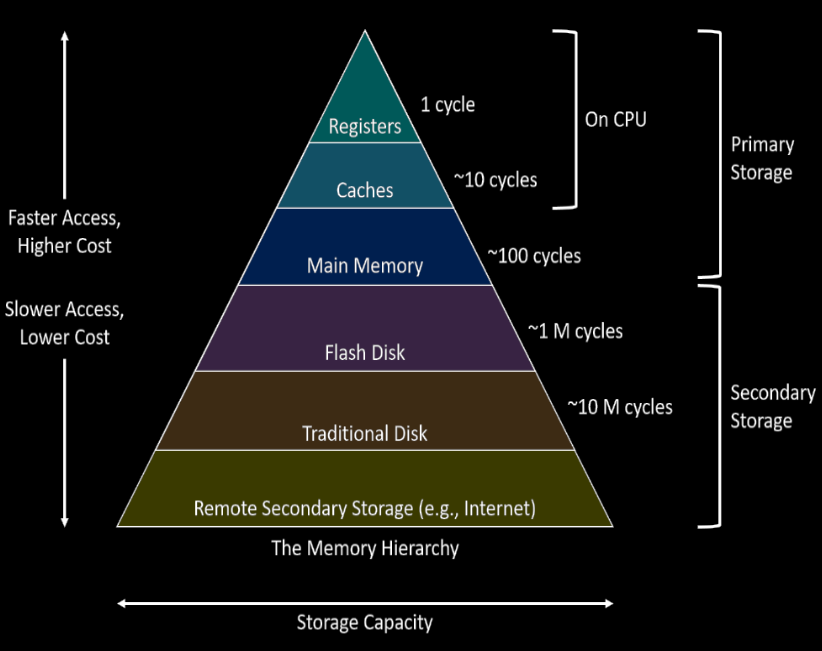
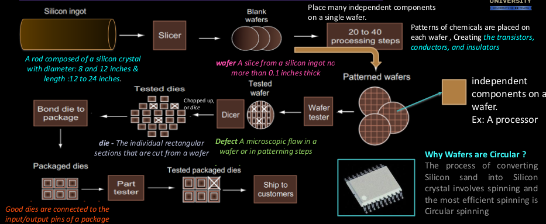

# Computer Abstraction and Technology
## 7 Great Ideas
### Abstraction
- Simplified view of hardware and software as hierarchical layers.
- Hardware in the center and application software outermost.
- An OS interfaces between user applications and hardware
- It helps us simplify the design of programs

### Parallelism
- Parallel computing is a computational model where a problem or program is broken into multiple smaller sequential computing operations some of which are performed simultaneously in parallel.

### Pipelining
- In a single cycle core, the clock period should be stretched to accomodate for the slowest instructions (The one that use all the stages)
- If the stages are performed independently, it's called pipelined execution

### Make the Common Case fast
- Make Common Case Fast will tend to enhance the performance better than optimizing the rare case

#### Amdahls's law
- Rule stating that performance enhancement is possible with the a given improvement is limited by the amount that the improved feature is used. A quantitative approach to diminishing returns

- $Overall\ Speedup = \frac{1}{(1 - f) + \frac{f}{s}}$
	- Where
		- $f ->$ Percentage of usage
		- $s ->$ Scale of Speedup

### Prediction
- Works on the assumption that mis-prediction is not too expensive and your prediction is relatively accurate
- It's faster to guess and start working on a branch rather than wait for the result
- This is branch prediction. In case of mis prediction the instructions loaded in the pipeline are flushed and the new instructions are taken up
- A branch predictor reduces the effect of pipeline flushing

### Hierarchy

### Dependability
- To make computers dependable in case of failures, we have a redundancies in place which take over in case of failures

> [!Note]
> #### Questions
> 1. What is the overall speed up if 10% of the program is 90% faster
> 2. What is the overall speedup if u make 90% of the program 10 times faster
> 3. Suppose a program runs in 100 seconds on a computer with multiply operations responsible for 80 seconds of the time. How much do I have to improve the speed of multiplication of I want my program to run 5 times faster

## Technology
### Chip Manufacturing Process
1. Starts with a the semiconductor silicon
2. Special chemicals are added to make in into:
	1. Conductor
	2. Insulator
	3. Areas that can conduct or insulate under specific conditions
3. This is made into a wafer :-  

### Formula
- $Dies\ Per\ Wafer = \frac{Wafer\ Area}{Die\ Area}$
- $Cost\ Per\ Die = \frac{Cost\ Per\ Wafer}{Dies\ per\ Wafer \times Yield}$
- $Yield = \frac{1}{(1 + (Defects\ Per\ Area \times Die\ Area))^N}$
	- Alternatively: $Yield = \frac{1}{(1 + Defects\ per\ Area \times \frac{Die\ Area}{2})^2}$
- $Die\ Yield = Wafer\ Yield \times Yield$ (If wafer yield $\neq$ 100%)
- $Defects\ Per\ Area = \frac{1 - \sqrt{Yield}}{\sqrt{Yield} \times \frac{Die\ Area}{2}}$

# Performance
- Lesser Response time Maximum is the performance
- $Performance = \frac{1}{Execution\ Time}$
- The system may try to optimize throughput rather than attempt to minimize the elapsed time for one program.
- CPU Execution time:
	- User Time - time for user applications
	- System Time - time for kernel functions
	- $CPU\ Execution\ Time = CPU\ clk\ Cycles \times Tc$
	- $CPU\ clk\ cycles = Number\ of\ Instructions \times Avg\ clk\ Cycles\ Per\ Instruction$

## Instruction Performance
### CPI (Clocks per Instruction)
- The average number of clock cycles each instruction takes to execute
- $CPU\ Time = Instruction\ Count \times CPI \times Clock\ Cycle\ Time$

### IPC (instructions per Clock)
- Number of instructions being fetched and executed per clock cycle
- For example dual core processor has a IPC of 2

### Single Core to Multicore

#### Challenge
- Manufacturers moved from single core processors to multicore processors
- This created a challenge to programmers. They had to rewrite their code that took advantage of this parallelism
- Programmer must divide an application so that each processor has roughly the same amount to do at the same time, and that the overhead of scheduling and coordination doesn’t fritter away the potential performance benefits of parallelism.

#### Solution
- Parallelism and Instructions: Synchronization.
- Parallelism and Computer Arithmetic: Subword Parallelism.
- Parallelism via Instructions.
- Parallelism and Memory Hierarchies: Cache Coherence.
- Parallelism and Memory Hierarchy: Redundant Arrays of Inexpensive Disks.

## Benchmarking
- Workload: A set of programs run on a computer
- Benchmarks: Programs specifically chosen to measure performance
- SPEC: (System Performance Evaluation Cooperative)
	- 10 integer benchmarks
	- 13 floating point benchmarkfloating points
- SPEC Ratio: Ratio of execution time of a benchmark on reference device to execution time of benchmark on target device

## Power Wall
- ${Power} \alpha {1/2} * {Capacitive\ Load} * {Voltage}^2 *{Freq.\ Switching}$
- For DMOS technnology, primary energy consumer is dynamic energy
- This limits the maximum clk frequency of processor because of their cooling requirments

> [!note]
> ## Fallacy:
> - Designing for performance and designing for energy efficiency are unrelated goals.
> - Since energy is power over time, it is often the case that hardware or software optimizations that take less time save energy overall even if the optimization takes a bit more energy when it is used.

> [!note]
> ## Pitfall:
> MIPS as a Performance Metric
> - does not take into account the capabilities of the instructions.
> - cannot compare computers with different instruction sets using MIPS, since the instruction counts will certainly differ.
> - cannot compare computers with different instruction sets using MIPS, since the instruction counts will certainly differ.

