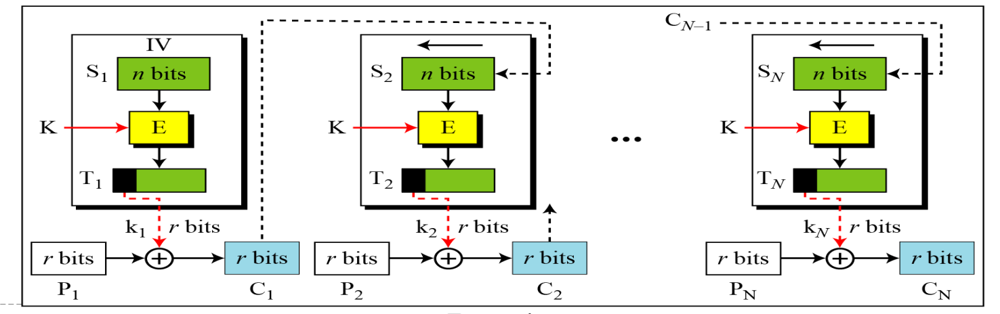
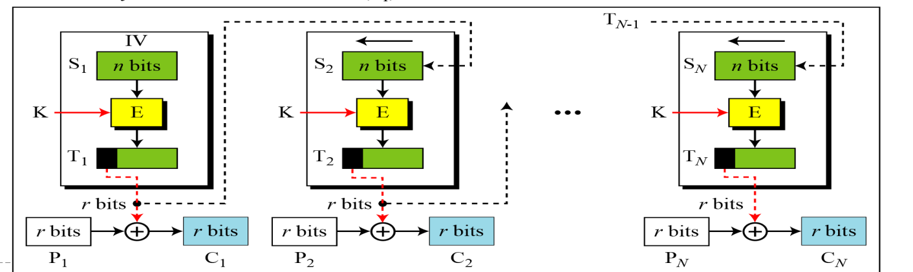
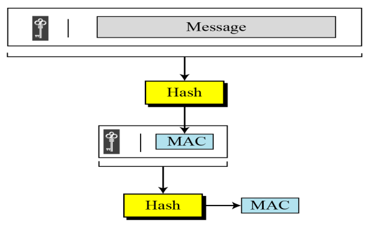

# U1: Introduction
## Classifications
- Key -> Symmetric & Asymmetric
- Process -> Stream (Cipher) & Block (AES, DES)
- Methods -> Transposition & Substitution

## Goals
- C - Confidentiality
- I - Integrity
- A - Availability

## Attacks
- Confidentiality
  - Snooping (P)
    - Eavsdropping on the messages between 2 parties but not affecting the message itself
  - Traffic Analysis (P)
    - Analysis on the frequency of the packets that are occur in the message and compare it to the frequency of commonly occurring data/packets ([Traffic Analysis](https://en.wikipedia.org/wiki/Traffic_analysis))
- Integrity
  - Modification (A)
    - Modification to the message when its enroute to destination
  - Masquerading (A)
    - Acting as the intended source/destination to hijack the connection 
  - Replaying (A)
    - Using packets intercepted by the attacker from the source and replaying it later
  - Repudiation (A)
    - When a conversation/ transfer takes place but one/ both parties does not acknowledge it ever happening (involves manipulation in logs)
- Availability
  - Denial Of Service (A)
    - Over flodding a server with so many requests such that clients cannot access the server

> [!NOTE]
> - A - Active
>   - Alteration to the message
>   - Hard to detect
>   - Easy to prevent
> - P - Passive
>   - No alteration to the message
>   - Easy to detect
>   - Hard to prevent

## Services
- Confidentiality
- Integrity
- Authentication
- Non Repudiation
- Access Control

## Mechanisms
- Confidentiality
  - Encipherment
  - Routing Control
  - Traffic Padding
- Integrity
  - Encipherment
  - Digital Signature
- Authentication
  - Encipherment
  - Digital Signature
  - Authentication Exchange
- Non Repudiation
  - Digital Signature
  - Data Integrity
  - Notarization
- Access Control
  - Access Control Mechanism

---
# U2: Algorithms
## Block Ciphers
### Feistal vs Non Fiestal
- Fiestal: Consists of self invertible, invertible, and non invertible components
- Non Fiestal: Only consists of non invertible components

#### Fiestel Structure
- 16 rounds: Each round uses different generated keys from the original key
- Split into LHS and RHS bits
- Formula:
    - $RHS_1 = LHS_0 xor (F_{k1}\{RHS_0\})$
    - $LHS_1 = RHS_0$
- Last round: swap LHS and RHS

#### Fiestel Properties
- Block size
- Key Size
- Number of rounds
- Subkey generation
- Round function
- Fast encryption/decryption
- Ease of analysis

### Attacks
- Linear Cryptanalysis
- Differential Cryptanalysis

---
## DES
### Properties
- Block cipher
- No. Rounds - 16
- Bits:
    - Input - 64 bits
    - Output - 64 bits
    - Main key - 64 bits
    - Subkey - 56 bits (After Parity drop)
    - Round key - 48 bits
- Avalanche Effect
    - 1 bit change in PT - 34 bits change in CT on avg
    - 1 bit change in key - 35 bits change in CT on avg


### Structure


#### Encryption
1. Initial Permutation (64 bits -> 64 bits)
2. 16 rounds (64 bits -> 64 bits)
3. 32 bit swap (64 bits -> 64 bits)
4. Inverse Initial Permutation (64 bits -> 64 bits)

#### Decryption
1. Initial Permutation (64 bits -> 64 bits)
2. 16 rounds (64 bits -> 64 bits) - with inverted order of keys
3. 32 bit swap (64 bits -> 64 bits)
4. Inverse Initial Permutation (64 bits -> 64 bits)

#### Round
1. Split into LHS and RHS bits
2. Round Formula:
    - $RHS_1 = LHS_0\ xor\ (F_{k1}\{RHS_0\})$
    - $LHS_1 = RHS_0$
3. F -> function (Mangler)
    1. Expansion Permutation (32 bits -> 48 bits)
    2. y = input xor key (48 bits -> 48 bits)
    3. Substitution S Box - 8 (6b -> 4b) S-Boxes (48 bits -> 32 bits)
    4. Transposition P box (32 bits -> 32 bits)

#### Key Generation


1. Split half (32b:32b split)
2. Drop bits - 8, 16, 24 ... (64 bits -> 56 bits)
3. Left circular shift both (56b -> 56b)
    - 1,2,9,16 rounds -> 1 shift
    - Rest rounds -> 2 shifts
4. Compression Permutation (56b -> 48b)

### Weakness
- Weakness in Key
- Weakness in S-Box
- Weakness in P-Box

#### Possible attacks
- Brute Force - Short cipher key combined with key complement weakness - just 2^55 encryption to try by brute force
- Differential Cryptanalysis - Resistant due to 16 rounds
- Linear Cryptanalysis - vulnerable
- Man in the middle - vulnerable for double DES

---
## AES
### Properties
- Non Fiestel
- Symmetric Block Cipher
- No. Rounds depends on variant (128, 192, 256) -> (10, 12, 14)
- Bits Size
    - Input - 128 bits
    - Output - 128 bits
    - Key - M bits (M -> variant of AES)
    - Round Key - 128 bits (16 bytes)

### Structure


#### Encryption
1. Initial transformation (Round 0 key) - Add Round key operation
2. Round \[0 to N - 1\] - 4 transformations
3. Round \[N\] - 3 transformations

#### Decryption
1. Initial transformation (Round 0 key) - Add Round key operation
2. Round \[0 to N - 1\] - 4 transformations (Key order reversed)
3. Round \[N\] - 3 transformations

#### Round

1. Substitute bytes - S-Box (Sub Byte)
2. Shift rows
    1. 0,1,2,3 - Untouched
    2. 1,2,3,0
    3. 2,3,0,1
    4. 3,0,1,2
3. Mix columns (Not there in last round)
```
    matrix -> 
    [2,3,1,1],
    [1,2,3,1],
    [1,1,2,3],
    [3,1,1,2]
```
4. Add Round Key (4 words from key scheduler) - Each word xor to each column

#### Key Generation


### Security
- Brute Force - More secure than DES
- Statistical Attacks - Fails
- Differential and Linear Attacks - none yet

---
## Mordern Block Ciphers
### ECB (Electronic Codebook)
- 
- No Error Propogation
- $$C_i = E_k (P_i)\ &\ P_i = D_k (C_i)$$

> [!NOTE]
> #### Ciphertext Stealing
> - Allows usage of ECB without padding
> - $X = E_k (P_{N - 1}) \rightarrow C_N = head_m (X)$
> - $Y = P_N | tail_{n-m} (X) \rightarrow C_{N - 1} = E_k (Y)$

### CBC (Cipher Block Chaining)
- 
- `xor` between `PT` and encryption block with input from previous block `CT`
- Initial Vector should be known be sender and reciever
- Error propogation possible
- Ciphertext Stealing can be applied here also

### CFB (Cipher Feedback)
- 
- Used when block sizes are too small for secure ciphers like AES/DES
- PT is `xor`ed with output of round block to get CT. This CT is used as input to block in next round
- Round block encrypts input with key to create output

### OFB (Output Feedback)
- 
- Similar to CFB, just ouput of round block is used as input to next round block

### CTR (Counter)
- 
- A counter is used
- It's incremented for each round and encrypted with round key

### Summary
- 

---
## Message Integrity
### Hash Function Critera
- Preimage resistance
- Second Preimage resistance
- Collision resistance

### MDC (Modification Detection Code)
- This is the output of cryptographic hash functions
- Proves integrity of message
- The message and MDC is send via channel

### MAC
- This is created by using a hash function with a shared key
- The message and MAC is send via channel

#### Nested MAC


#### HMAC


#### CMAC

