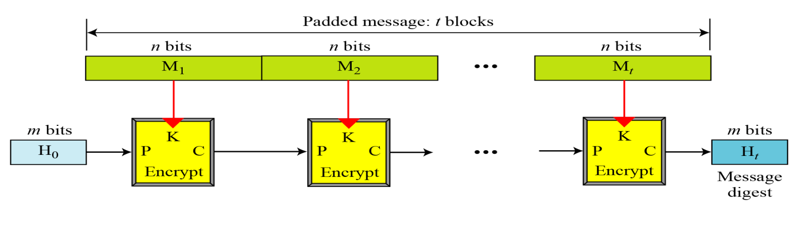
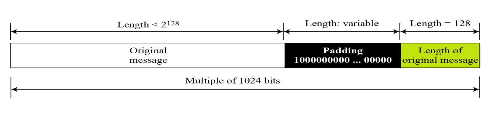

# U3: Asymmetric Key Cryptography
Using a private key (not shared) and a public key (which is distributed) for encryption

## Maths
### Euler's Phi/Totient Function
- $\phi(1) = 0$
- $\phi(p) = p - 1$ for p -> Prime number
- $\phi(m\ x\ n) = \phi(m) \times \phi(n)$ for `m`, `n` are relative primes
- $\phi(p^e) = p^e - p^{e - 1}$ for p-> prime number

### Fermat's Little Theorem

> [!NOTE]
> Only apply if p -> Prime number

1. $a^{p - 1} = 1\ mod\ p$
2. $a^p = a\ mod\ p$
2. $a^{-1} mod\ p\ = a^{p - 2}\ mod\ p$

### Euler's Theorem
1. $a^{\phi(n)} = 1\ (mod\ n)$
2. $a^{k\ x\ \phi(n) + 1} = a\ (mod\ n)$
3. $a^{-1} mod\ n\ = a^{\phi(n) - 1}\ mod\ n$

## Principles
### Authentication
- Can be implemented by using the keys (public and private) from the same key source
- For example: in the communication between A and B if A's private key is used for encryption and A's public key is used for decryption by B, A is the aunthenticated sender 

### Confidentiality
- Using double encryption and decryption:
  - Encrypt using the private key of A and public key of B
  - Decrypt using the private key of B and public key of A

## RSA
### Key Generation
1. Select 2 **relatively prime** numbers (p,q)
2. $n = p * q$
3. $\phi(n) = (p - 1)(q - 1)$
4. Choose value of `e` such that $1 < e < \phi(n)$ and $gcd(e,\phi(n)) = 1$
5. $d = e^{-1} mod\ \phi(n)$

#### Private Key
$$\{e,n\}$$

#### Public Key
$$\{d,n\}$$

### Encryption
$$c = m^e mod\ n$$

### Decryption
$$m = c^d mod\ n$$

### Potential Attacks
- Factorisation
- Chosen Cipher Text - Intercept and masking plaintext
- Encryption Exponent - When the encryption exponent is set too low (Recommended: Prime numbers around $2^{16} + 1$
	- Coppersmith
		- For $C = M^e mod\ N$
		- If $M < N^{\frac{1}{e}}$, M can be directly recovered by taking `e`th root of C 
	- Broadcast
		- If Alice sends the same message with same exponent to 3 different recipients, attacker (Eve) can use chinese remainder theorem to decrypt the message
	- Related messages (Franklin Reiter)
		- If 2 messages (P1 and P2) were encrypted with same `e`, and if P1 is related to P2 in by a *linear function*, Eve can decrypt the corresponding C1 and C2 in feasible computation time
	- Short pad (Coppersmith)
		- Alice pads with r1, encrypts and sends message to Bob
		- Eve intercepts and drops message (C1)
		- Bob requests message again and Alice sends again with padding of r2
		- Eve intercepts again (C2)
		- Eve knows C1 and C2 has same plaintext
		- If r1 and r2 are short, Eve can recover original plaintext
- Decryption Exponent - Releaved and low exponent
- Plaintext
	- Short message
		- Short messages can be easily decrypted by brute force
		- Use padding (in the start or end of message) using `OAEP` to prevent this
	- Cyclic
	- Unconcealed
- Modulus - Common modulus
- Implementation
	- Timing and power (Paul Kocher)
		- Blinding and Random Delays can help with this

## Diffie Hellman Key Exchange Algorithm
### Procedure
1. Consider a prime number q
2. Select $\alpha$ such that $\alpha < q$ and $\alpha$ is *primitive root* of q
3. Assume $X_A$ (Private key of A) and $X_A < q$. Calculate $Y_A = \alpha^{X_A} mod\ q$ (Public Key of A)
4. Repeat previous step for B
5. Calculate secret keys
  - $K_A = (Y_B)^{X_A} mod\ q$
  - $K_B = (Y_A)^{X_B} mod\ q$
6. If $K_A == K_B$, key exchange succesfull
### Man in the middle attack
Insert a man in the middle of A and B (Eve) and carry out diffie hellman exchange with each A and B

> [!TODO]
> Complete this section

## El-Gamal
### Key Generation
1. Select prime number P
2. Select private key d
3. Select 2nd part of encryption key $e_1$
4. Select 3rd part of encryption key $e_2$
	- $e_2 = e_1^d mod\ P$
5. Public key = $(e_1, e_2, P)$, Private Key = $d$

### Encryption
1. Select random integer r
2. Calculate $C_1 = e_1^r mod\ P$
3. Calculate $C_2 = (M * e_2^r) mod\ P$
4. Cipher Text = $(C_1, C_2)$

### Decryption
1. $M = [C_2 * (C_1^D)^{-1}] mod\ P$

## Knapsack Algorithm

> [!TODO]
> Complete this section

Given:
- Sum (S)
- Weights (W) - Superincreasing tuple

### Key Generation
#### Public Key (Hard Knapsack)
#### Private Key (Easy Knapsack)

## Key Distribution
### Methods
- Public Announcement
- Public Key Directory
- Public Key Authority
- Certificate Authority

## Digital Signature
A cryptosystem uses the private and public keys of the receiver: a digital signature uses the private and public keys of the sender

### Services
- Message Authentication
- Message Integrity
- Nonrepudiation

### Attacks Types
- Key Only Attack
- Known Message Attack
- Chosen Message Attack

### Forgery Types
- Existential Forgery
- Selective Forgery

### Algorithms
#### RSA Digital Signature
- Signing
	- $S = M^d mod\ n$
- Verifying
	- $M' = S^e mod\ n$
	- If $M' == M$, accept

##### With Message Digest
- Signing
	- $D = h(M)$ (Digest)
	- $S = D^d mod\ n$
- Verifying
	- $D' = S^e mod\ n$
	- If $D' == h(M)$, accept

#### ElGamal Digital Signature
- Public key - $(e_1, e_2, p)$, Private key - $d$
- Signing
	- $S_1 = e_1^r mod\ p$
	- $S_2 = (M - dS_1)r^{-1} mod(p - 1)$
- Verifying
	- $V_1 = e_1^M mod\ p$
	- $V_2 = e_2^{S_1} S_1^{S_2} mod\ p$
	- If $V_1 == V_2$, accept

#### Schnorr Digital Signature
- Public key - $(e_1, e_2, p, q)$, Private key - $d$
- Signing
	- $S_1 = h(\ M\ |\ e_1^r mod\ p\ )$
	- $S_2 = r + dS_1\ mod\ q$
- Verifying
	- $V = h(\ M\ |\ e_1^{S_1} e_2^{-S_2} mod\ p\ )$
	- If $V == S_1$, accept ($S_1$ is congruent to $V\ mod\ p$)

#### Digital Signature Standard
- Public key - $(e_1, e_2, p, q)$, Private key - $d$
- Signing
	- $S_1 = (e_1^r\ mod\ p)\ mod\ q$
	- $S_2 = (h(M) + dS_1)\ r^{-1}\ mod\ q$
- Verifying
	- $V = (e_1^{h(M) S_2^{-1}}\ e_2^{S_1 S_2^{-1}}\ mod\ p)\ mod\ q$
	- If $V == S_1$, accept ($S_1$ is congruent to $V\ mod\ p$)
- Properties:
	- Faster computation wrt RSA
	- Smaller signatures wrt ElGamal
#### Elliptic Curve Digital Signature

### Application
- Time Stamped Signatures
	- Time stamped to prevent replay of documents
- Blind Signatures (David Chaum)
	- Signing without knowing content of message
	- Procedure
		- Blinding the message from Bob: $B = M\times b^e mod\ n$ (`e` -> Alice Public Key, `b` -> Blinding Factor)
		- Signing by Alice: $S_{blind} = B^d\ mod\ n$
		- Unblind by Bob: $S = S_b b^{-1}\ mod\ n$

---
# U4: Network Security Protocols
## Iterated Hash Function
### Merkle Damgard Scheme
Multiple chained compression functions

### Rabin Scheme
Each message block is used as K for each encrypt block

### Davies-Meyer Scheme
Output (Ciphertext) of each encrypt block is XORed with input plaintext

### Matyas-Meyer Oseas Scheme
P and K are switched in each block. K is XORed with C

### Miyaguchi-Preneel Scheme
XOR is done with K and P to C

## Cryptographic Hash Functions
### SHA-512 (Secure Hash Algorithm)
- Based on Merkle-Damgard Scheme
- Creates hash of 512 bits out messages less than $2^128$
- Structure: 
- Padding: 
- Compression Function: 
- Round Structure: 
- Word Expansion: 

### Whirpool
- Based on Miyaguchi-Preneel
- Modified AES cipher
- Hash function: 
- Whirpool cipher: 
- Round structure: 
- Key expansion: 
- Round constants:
  - $RC_{round}[row, column] = SubBytes(8(round - 1) + column)$ if $row = 0$
  - $RC_{round}[row, column] = 0$ if $row \neq 0$
- Properties: 

## Entity Authentication
### Passwords
#### Fixed Passwords Approaches
- User ID and Password File
	- Attacks:
		- Eavesdropping
		- Stealing
		- Accessing Password file
		- Guessing
- Hashing the Password
	- Attacks:
		- Dictionary Attack
- Salting the Password
- Combining Multiple Identification Techniques
#### One Time Password
- Pre agreed list of passwords for user and system to use
- Sequential update of passwords
- Sequential update using hash function
	- Lamport OTP: 

### Challenge Response
#### Symmetric Key Cipher
- Nonce challenge: 
- Timestamp: 
- Bidirectional Authentication: 

#### Keyed Hash Functions

#### Assymetric Key Cipher
- Unidirectional, assymetric key authentication: 

- Bidirectional, assymetric key authentication: 
#### Digital Signature
- Unidirectional, Digital Signature authentication: 

- Bidirectional, Digital Signature authentication: 

## Zero Knowledge
- Fiat Shamir: 
- Fiege Fiat Shamir: 
- Guillou Quisquater: 

## Symmetric Key Agreement
Creating session key without KDC

### Diffie Hellman

#### Attacks
- Discrete Logarithm
- Man in the middle
  - 

### Station to station

## KDC (Key Distribution Center)
### Types
- Hierarchical
- Flat Multiple

### Protocol
#### Simple

#### Needham-Schroeder

#### Otway-Rees

## Certificates
### CA (Certificate Authority)

### Certificate Format

- Version number
- Serial Number
- Signature Algorithm ID
- Issuer Name of CA
- Validity Period
- Subject Name
- Subject Public Key
- Issuer Unique Identifier
- Subject Unique Identifier
- Extensions
- Signature

### Certificate Renewal
CA issues a new certificate before old one expires after the period of validity

### Certificate Revocation
Format:
- Signature algorithm ID
- Issuer name
- This update date
- Next update date
- Revoked certificate list
- Signature

### Delta Revocation
More efficient revocation (Delta CRL)

## Kereberos

