# Network Security Protocols
## Iterated Hash Function
### Merkle Damgard Scheme
Multiple chained compression functions

### Rabin Scheme
Each message block is used as K for each encrypt block

### Davies-Meyer Scheme
Output (Ciphertext) of each encrypt block is XORed with input plaintext

### Matyas-Meyer Oseas Scheme
P and K are switched in each block. K is XORed with C
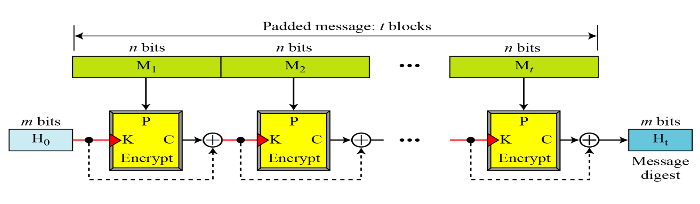

### Miyaguchi-Preneel Scheme
XOR is done with K and P to C

## Cryptographic Hash Functions
### SHA-512 (Secure Hash Algorithm)
- Based on Merkle-Damgard Scheme
- Creates hash of 512 bits out messages less than $2^128$
- Structure: 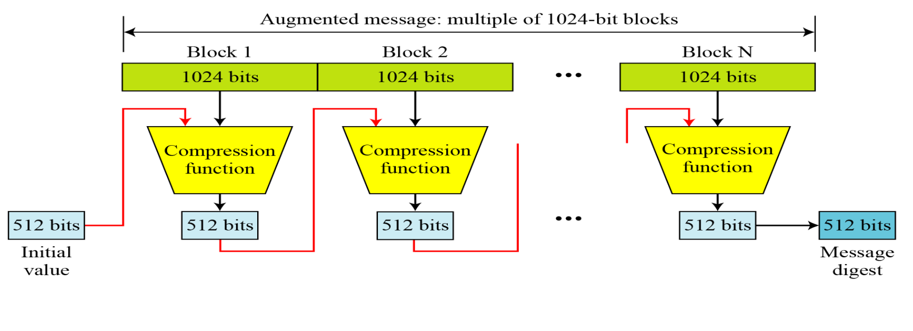
- Padding: 
- Compression Function: 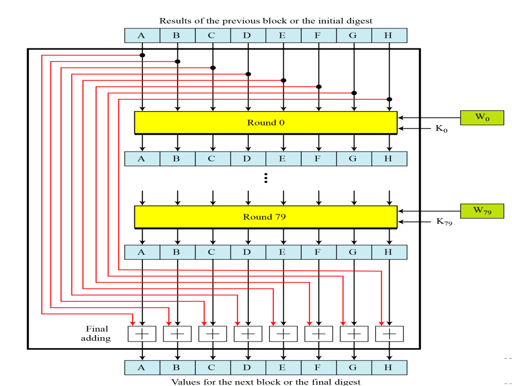
- Round Structure: 
- Word Expansion: 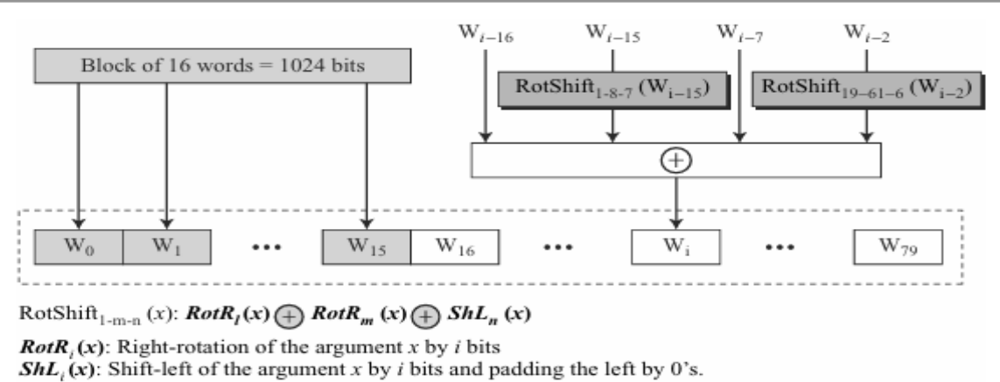

### Whirpool
- Based on Miyaguchi-Preneel
- Modified AES cipher
- Hash function: 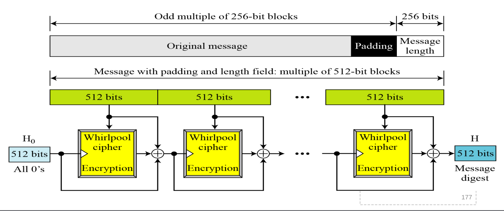
- Whirpool cipher: 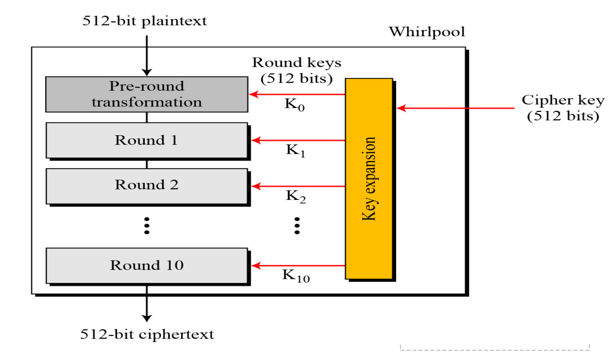
- Round structure: 
- Key expansion: 
- Round constants:
  - $RC_{round}[row, column] = SubBytes(8(round - 1) + column)$ if $row = 0$
  - $RC_{round}[row, column] = 0$ if $row \neq 0$
- Properties: 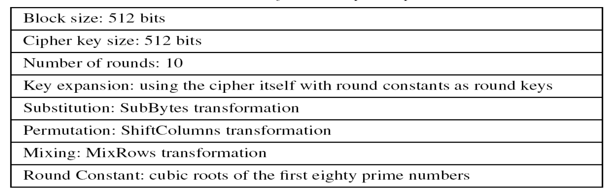

## Entity Authentication
### Passwords
#### Fixed Passwords Approaches
- User ID and Password File
	- Attacks:
		- Eavesdropping
		- Stealing
		- Accessing Password file
		- Guessing
- Hashing the Password
	- Attacks:
		- Dictionary Attack
- Salting the Password
- Combining Multiple Identification Techniques
#### One Time Password
- Pre agreed list of passwords for user and system to use
- Sequential update of passwords
- Sequential update using hash function
	- Lamport OTP: 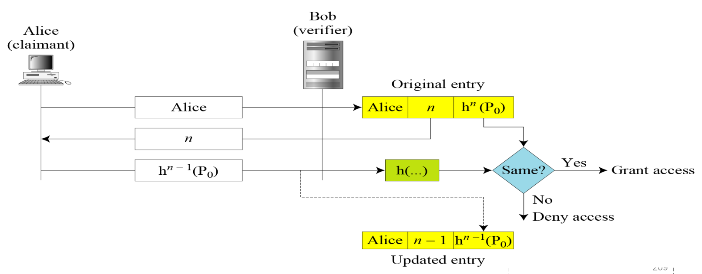

### Challenge Response
#### Symmetric Key Cipher
- Nonce challenge: 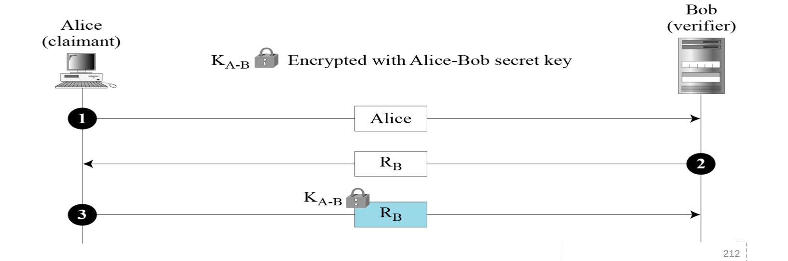
- Timestamp: 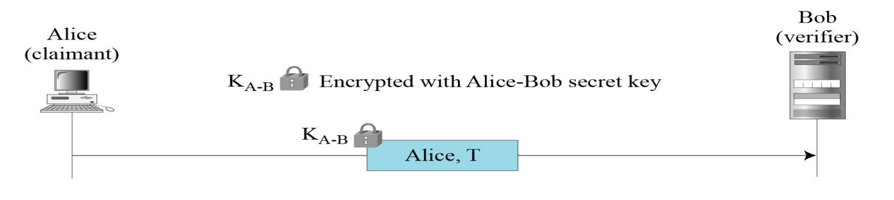
- Bidirectional Authentication: 

#### Keyed Hash Functions
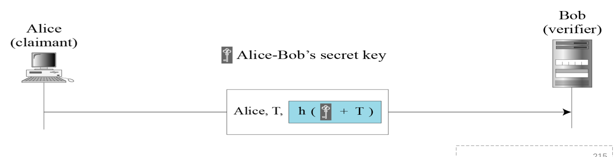

#### Assymetric Key Cipher
- Unidirectional, assymetric key authentication: 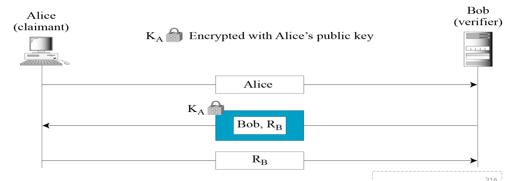

- Bidirectional, assymetric key authentication: 
#### Digital Signature
- Unidirectional, Digital Signature authentication: 

- Bidirectional, Digital Signature authentication: 

## Zero Knowledge
- Fiat Shamir: 
- Fiege Fiat Shamir: 
- Guillou Quisquater: 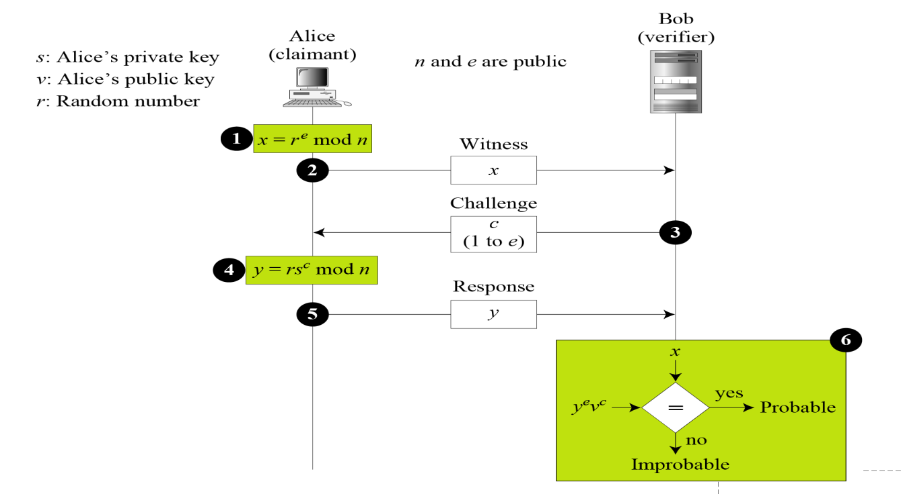

## Symmetric Key Agreement
<!-- TODO: Insert Pictures-->
- Diffie Hellman
	- Structure:
	- Attack:
		- Discrete Logarithm
		- Man in the middle
- Station to station

## KDC (Key Distribution Center)

## Certificates
### CA (Certificate Authority)
### Certificate Format

- Version number
- Serial Number
- Signature Algorithm ID
- Issuer Name of CA
- Validity Period
- Subject Name
- Subject Public Key
- Issuer Unique Identifier
- Subject Unique Identifier
- Extensions
- Signature

### Certificate Renewal
### Certificate Revocation
- Format:
### Delta Revocation

## Kereberos

