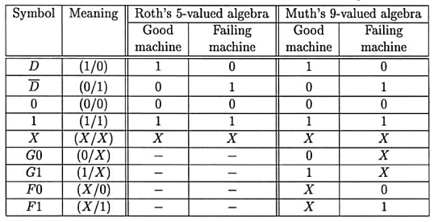

# Introduction to Testing And ATPG
## Introduction
### Possible outcomes of testing
- True Pass
- True Reject
- Test Escapes (Under testing)
- Yield Loss (Over Testing)

### Testing Philosophy
Electronic testing also uses fault modeling and tests are generated for the  assumed fault models

#### Digital and Analog Testing
- In digital chip testing, report focuses on pattern pass/fail information
- While in analog chips, Parameteric tests reporting measurement results are required

#### VLSI Flow
- Define requirements
- Define specification
- Design and test
  - Architectural
  - Logic
  - Physical
- Fabrication
- Process analysis
- FMA (Failure Mode Analysis)

### VLSI Trends
- Test complexity
- Feature scaling and power dissipation ($Power Density = C \times V_{DD}^2 \times f$)
    - Verification testing must check for power buses overloaded by excessive current
    - Application of the test vectors may cause excessive power  dissipation on the chip and burn it out
    - Shrinking features will eventually require the design of  transistors with reduced threshold voltage

### IDDQ Testing
- During switching, the current flowing through the circuit, spikes up and settles down to quiscient current ($I_{DDQ}$)
- This current is dependant on faults like SaFs, shorts, etc
- By analysing the current through ground busses and comparing it to a threshold, we can effectively test the chip

## Single Stuck at Fault
- We assume Circuit is modelled as interconnection (netlist) and faults only affect the interconnection between gates
- Each line can have 2 types of faults (sa0, sa1)
- For the sake simplicity, we assume only single SaFs to be present in a circuit at a time
- Properties/ Assumptions:
    - Only 1 line is faulty
    - Faulty lines is permanently set to 0/1
    - Fault can be at the input/output of a gate
- We need to propagate this fault to the output ports by setting the other other input ports to some specific value to observe and test this fault

## Fault Reduction
Methods to reduce the number of faults site to test

### Fault Equivalence
- When 2 circuits have the same test vectors, both tests are indistinguishable/ equivalent
- Two faults of a Boolean circuit are called equivalent  if they transform the circuit such that the two faulty circuits have  identical output functions. Equivalent faults are also called  indistinguishable and have exactly the same set of tests
- This can also be tested by checking the output boolean expression assuming each SaF individually. If the final boolean equations are equivalent, it indicates fault equivalence
- Common ckts and FEs:
    - AND - sa0
    - OR - sa1
    - NAND - sa0 (input), sa1 (output)
    - NOR - sa1 (input), sa0 (output)

### Fault Collapse
- Selecting one of the equivalent faults from each other is fault collapse
- $Collapse\ Ratio\ =\ frac{Set\ of\ collapsed\ faults}{Set\ of\ all\ faults}$
    - Where set of selected faults is known as the equivalence collapsed set

### Fault Dominance
- If all tests of some fault F1 detect another fault F2, then F2 is said to dominate F1
- If fault F2 dominates F1, then F2 is removed from the fault list

### Checkpoint Theorem
- Primary inputs and fanout branches of a combinational circuit	are	called the checkpoints
- A test set that detects all single stuck-at faults of the checkpoints of a  combinational circuit detects all single stuck-at faults in that circuit

## Automatic Test Pattern Generator
ATPG algorithms inject a fault into a circuit, and then use a variety of  mechanisms to activate the fault and cause its effect to propagate  through the hardware and manifest itself at a circuit output

### Scan Design
Inserting special purpose muxes and clocking hardware to every flip flop for testing

### Algortihm Completeness
- In order to generate a test patterm the algorithm must be able to search the entire binary decision tree if necessary to generate a test patter for all faults
- If the fault is untestable, the chip behave correctly even in presence of the fault
- Completeness is required for ATPG algorithm to attain required fault coverage

### Algebra
- Roth's algebra was enough for combinational logic
- But for FSMs, we require Muth's algebra

### ATPG Algorithms
#### Exhaustive
Generate all $2^n$ input input patterns for an n-input circuit

#### Random – Used With Algorithmic Methods
Use randomly generated patterns and see how many faults are detected. Repeat until good enough coverage

#### Deterministic ARPG techniques
##### Symbolic Boolean Difference
- Algebraic method to generate all the possible test vectos to detect a fault. Hard to implement in algorithm
- Based on Shanon's expansion theorem

##### Path Sensitization
- Fault sensitization
- Fault propagation
- Line justification

> [!NOTE]
> When a conflict occurs between the 2nd and 3rd step, we need to take a new alternative path for fault propagation to justify all signals

### Redundancy Identification
- We only consider hardware that is untestable for stuck-faults to be redundant
- Redundant faults can mask the testable faults
- Use Kmaps to find redundant hardware and hence faults

## Fault Modelling
- Defects: Unintended difference between implemented hardware and intended design
- Error: Wrong output signal caused by a defect
- Fault: Representation of a defect

### Typical Defects in VLSI Chips
- Process Defects
- Material Defects
- Age Defects
- Package Defects

### Functional vs Structural Testing
- Complete functional test will check each entry of the truth table
- Hardware test (also referred to as manufacturing test) is to discover any faults caused due to manufacturing defects or errors
- Structural testing is a method which lets use observe the internal signal (and hence the faults) at the primary outputs via specific algorithms

### Glossary of Fault Models
#### Assertion Fault
An assertion fault means that the corresponding property is not “true” for some input of the system.

#### Behavioral Faults
Behavioral faults refer to incorrect execution of the language constructs  used in the description

#### Branch Fault
Branch fault affects a branch statement and causes it to branch to an incorrect destination

#### Bridging Fault
Bridging fault  represents a short between a group of signals

#### Bus Fault:
A bus fault specifies the status for each line in a bus as stuck-at-0,  stuck-at-1, or fault-free

#### Cross-point Fault
- **Missing cross-point** means a missing connection at a crossing where a  connection was intended.
- **Extra cross-point** means a faulty connection at a crossing where no  connection was intended.

#### Defect-Oriented Faults
The electrical or logic-level faults that can be produced by physical  defects are classified as defect-oriented faults

#### Delay Fault:
These faults cause the combinational delay of a circuit to exceed the clock period.

#### Gate-Delay Fault:
The fault increases the input to output delay of a single logic gate, while all other gates retain some nominal values of delay

#### Hyperactive Fault
Hyperactive fault causes a large number of signals in the circuit to  differ from their correct values

#### Initialization Fault
Faults that interfere with initialization of memory like elements are called initialization faults

#### Instruction Fault
An instruction fault causes an intended instruction to be incorrectly executed

#### Intermittent Fault
A fault that appears and disappears as a function of time is called an  intermittent fault

#### Line-Delay Fault
This fault models rising and falling delays of a given signal line

#### Logical Faults

#### Memory Faults

#### Multiple Fault

#### Non-classical Fault

#### Oscillation Fault

#### Parameteric Fault

#### Path Delay Fault

#### Pattern Sensitive Fault

#### Permanent Fault

#### Physical Fault

#### Pin Fault

#### PLA Fault
- Stuck-at faults on inputs and outputs.
- Cross-point faults
- Bridging faults

