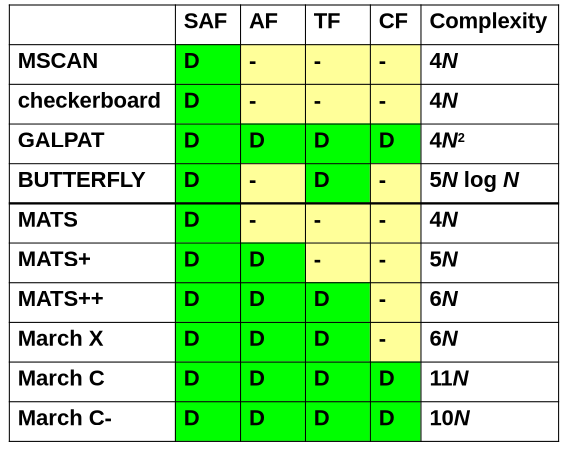

# DFT Logic, BIST & Memory Testing
## DFT
### Links
- [LOS/LOC](https://www.youtube.com/watch?v=Km3WCLu4THA&t=111s)
- [LSSD](https://www.youtube.com/watch?v=r9g4kCnKGyg)

### Why Design for Testability
- Reduce ATPG effort
- Improve test quality
- Resduce test cost
- Reduce time to market

### Ad Hoc DFT
- Not generizable to other circuits, learned from experience
- Rules:
  - Design ckts easily initializable
  - Disable internal clocks during test
  - Parition large circuits into small blocks
  - Insert test points into ckts of low testability
    - Control points
    - Observation points

### Scan Chains
Replace FFs/latches with scan FFs and connect them together to make a chain of shift registers

#### Scan FF
- Pins:
  - Scan Input, Scan Output
  - Data Input (PPO), Data Output (PPI)
- Modes:
  - Normal (capture)
  - Test (shift in, capture, shift out)

#### Pros
- Systematic DFT - More EDA support
- Easy DFT

#### Cons
- Area overhead
- Performance overhead
- Pin overhead
- Extra design efforts

#### Muxed D Scan FF
- A mux controlled by SE (Scan Enable) placed in front of a D-FF
- Tests:
  - SAF (Stuck at Faults)
  - LOS (Launch on Shift)
  - LOC (Launch on Capture)

#### Clocked Scan FF
2 Independant Clocks:
- Scan clock (SCK) - capture SI
- Data clock (SCK) - capture DI

##### Pros
Faster that Muxed SFF

##### Cons
Larger routing overhead than SFF
- Needs 1 extra clock (SCK)

#### Shadow Scan Chain
- Allow normal operations during scan chain shifting
- Useful fo DfD (Design for Debug)
- 4 Clocks
  - Normal: DCK
  - Capture: CCK
  - Shift: TCK
  - Update: UCK

#### LSSD (Level Sensitive Scan Design)

#### Double Latch Based design (w/o LSSD)

## Memory Testing
### Functional Fault Models
#### Static
##### Single Cell
Notation: $<S/F>$, where:
- S -> value or operation activating fault $S \rightarrow \{0, 1, \uparrow, \downarrow, updownarrow\}$
- F -> Faulty value of cell $F \rightarrow \{0, 1, \updownarrow\}$

###### Stuck at Fault (SAF)
Always stuck at a single state
- SA0
- SA1

###### Stuck Open Fault (SOF)
Cell cannot be accessed due to broken wire

###### Transition Fault (TF)
Cell fails to
- Rise from 0 to 1 $< \uparrow, 0>$
- Fall from 1 to 0 $< \downarrow, 1>$

##### Double Cell
###### Coupling Faults
- **Victim cells** are affected by **Aggressor cell**
- Notation: $<S_1; S_2/F>$, where:
  - $S_1$ is activator for fault in aggressor
  - $S_2$ is activator for fault in victim
  - $F$ is faulty value of victim

###### State CFs
- If aggressor cell is in a given state, victim cell is forced to 0 or 1
- Ex: $<0;\ 0/1>$, $<0;\ 1/0>$, $<1;\ 0/1>$, $<1;\ 1/0>$

###### Inversion CFs
- If aggressor cell rise or fall, victim cell is inverted

###### Indempotent CFs
- If aggressor cell rise or fall, victim cell is forced to 0, 1

##### Address Decoder Fault (AF)
- Given a certain address, no cell will be accessed
- A certain cell is never accessed by any address
- A certain cell is accessed by multiple addresses
- Given a certain address, multiple cell will be accessed
###### AND Type
###### OR Type

#### Dynamic
##### DRF (Data Retention Faults)
###### DRAM
- Charge leakage loose data in capacitor
- Refresh logic fails to refresh correctly

###### SRAM
- Defective pull-up device inducing excessive leakage current which changes the state of the cell

##### Sense Amplifier Recovery Fault
Saturated sense amplifier after reading/writing a long string of 0 or 1

##### Write Recovery Fault
A write followed by a read/write at a different location results in reading or writing at the same location due to slow address decoder

### Test Algorithm
#### MSCAN
- One-zero algorithm
- Read and write 1 and 0 each to every cell sequentially
- Complexity:- $4 N$
- Detects all SAF, $<\uparrow/0$ TF

#### Checkerboard
- Write and read checkerboard pattern and it's complement to all cells
- Detects SAF, half TF
- Complexity:- $4 N$

#### GALPAT
- Ping pong test
- Detects all SAF, TF
- Complexity:- $4 N^2$

#### Butterfly
- Detects SAF, TF
- Complexity:- $10 N\ log\ N$

#### March Test
- Complexity:- Linear to number of operations $Ops * N$

##### MATS (Modified Algorithmic Test Sequence)
- 3 March Elements: $\{\updownarrow(w0); \updownarrow(r0, w1); \updownarrow(r1)\}$
- Complexity:- $4 N$
- Detects SAF, Half of TF, half AF
- Can detect half of address decoder fault (OR Type)
  - Solution: Reverse MATS: $\{\updownarrow(w1); \updownarrow(r1, w0); \updownarrow(r0)\}$
  - Can detect AND but can't detect OR type faults

##### MATS+
- Combine AND type and OR type MATS
- March: $\{\updownarrow(w0); \uparrow(r0, w1); \downarrow(r1, w0)\}$
- Detects SAF, AF, Half of TF
- Complexity:- $5 N$

##### MATS++
- March: $\{\updownarrow(w0); \uparrow(r0, w1); \downarrow(r1, w1, r0)\}$
- Detects SAF, AF, TF

##### March X
- March: $\{\updownarrow(w0); \uparrow(r0, w1); \downarrow(r1, w0); \updownarrow(r0)\}$
- Detects SAF, AF, TF, $CF_{in}$

##### March C
- Combine March X in opposite address order
- March: $\{\updownarrow(w0); \uparrow(r0, w1); \uparrow(r1, w0); \updownarrow(r0); \downarrow(r0, w1); \downarrow(r1, w0); \updownarrow(r0)\}$
- Detects SAF, AF, TF, all CF

##### March C-
- March: $\{\updownarrow(w0); \uparrow(r0, w1); \uparrow(r1, w0);\ \ \ \  \downarrow(r0, w1); \downarrow(r1, w0); \updownarrow(r0)\}$
- Removes a redundancy
- Detects SAF, AF, TF, all CF

##### Summary

## Introduction to BIST
Adding extra hardware to chip for test generation and response evaluation

### Test Pattern Generation
#### LFSR (Linear Feedback Shift Register)
- Test pattern generator
- Types
	1. XOR in feedback
	2. XOR in forward path
- Number of unique Test Vectors:
	- Characteristic polynomials give $2^N - 1$ patterns (Cannot be divided by any other polynomial)
	- Non characteristic polynomials give $\lt 2^N - 1$ patterns and number of unique vectors depends on seed value
- M - Sequence (Max Length sequence) is generated by primitive/characteristic polynomials

##### De Bruijn Counter
- Also generates the `0000` test vector
- Add an AND gate from all registers (except last) to feed it to the XOR gate

### Output Response Analysis (ORA)
- Compress CUT output to small signature
- Compare signature with gold signature to determine good/bad
- Aliasing:
  - When $signature_{faulty\ output} = signature_{good\ output}$
  - $PAL = \frac{no.\ faulty\ outputs\ with\ gold\ signature}{total\ no.\ faulty\ outputs}$
- Good ORA requires low PAL, small area, small signature, diagnosis support
