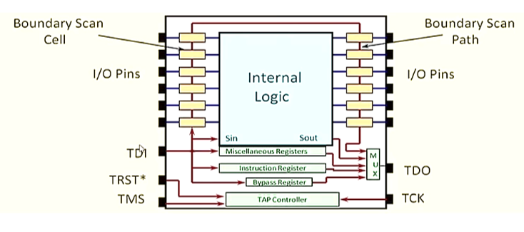
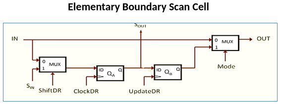

# Low Power Test – Test Compression & Boundary Scan
## Boundary Scan
### Test Wrapper (IEEE 1149.1 Standard)
- 
- 
### TAP (Test Access Point)
### Instructions
#### EXTEST
Test interconnections b/w chips
#### BYPASS
Bypass one chip and forwards the test to next chip
#### INTEST
Test internal logic of selected chip

## Test Compression
Reduces ATE cost, test cost and package cost

### Software Techniques
#### Comparison

| STC                 | DTC                  |
| ------------------- | -------------------- |
| Performed after TPG | Performed during TPG |
| Less CPU time       | More CPU time        |
| Less effective      | More effective       |

#### STC (Static Test Compression)
#### With Dictionary
##### Quine McCluskey Method
- Faults that are detected only once in the covering table are called essential faults
  - Must select essential patterns which detect these faults
- Remove equivalent row
- Remove dominated row

#### Without Dictionary
##### X-unfilled
- Compatibility graph
  - Clique is a subset of vertices such that each pair of vertices are connected
  - Clique is a complete subgraph
  - Partition graphs into minimum number of cliques
##### X-filled
- Remove redundant test vectors if the coverage reaches 100%
- Can be in random order/ reverse order of ATPG

### Hardware Techniques
#### Test Stimulus Compression
- Reduce size of test pattern
- $Compresion\ Ratio = \frac{Original\ Data}{Compression\ Data}$
##### Code Based
- Large hardware overhead
- Synchronisation problem

###### Dictionary code
- Fixed to fixed
- Symbol to codeword
- Scan slice is vertical column of scan data

###### Huffman code
- fixed to variable

##### Broadcast Based
Broadcast compatible test vector

##### Linear Decompression
- Reseed an LFSR to jump vectors and run for `c` cycles
- $CR = \frac{L \times c}{N}$
  - $N = Care\ bits + 20$

#### Test Response Compression
##### Space Compaction
Reduce output pins

##### Time Compaction
Reduce output length

###### Single XOR Tree
- Reduce outputs to just 1 pin
- Increases PAL to `0.5`
  - Can only detect odd number of errors
- High CR
- Cannot tolerate X

###### X Compact
- Support for X
- Multiple XOR Trees
